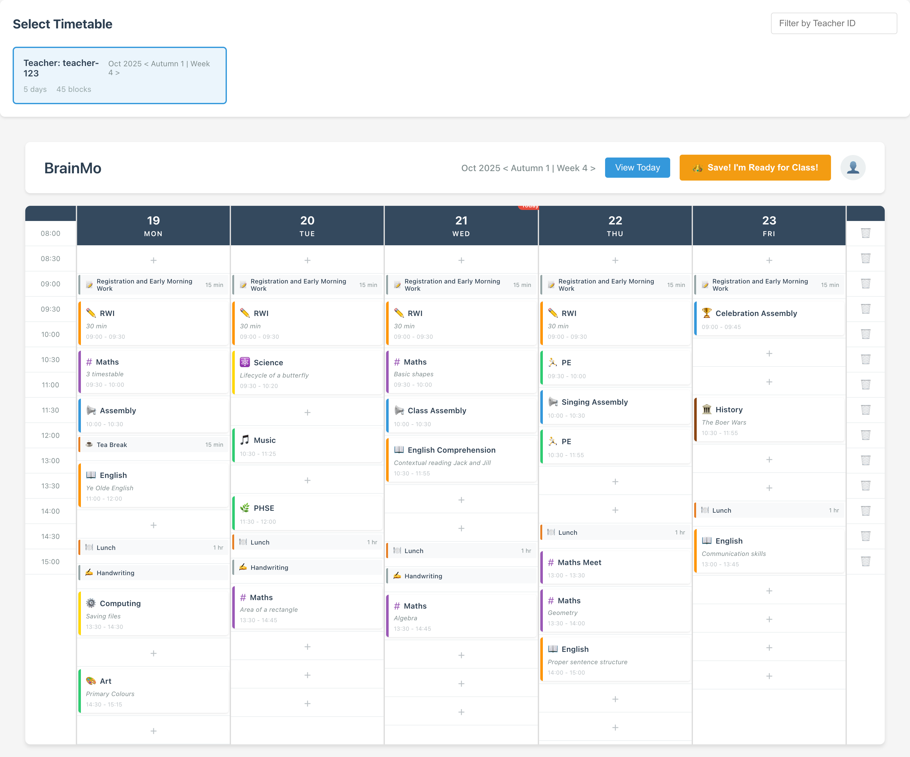
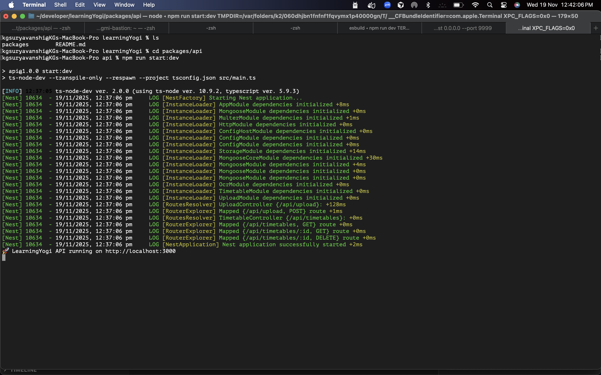
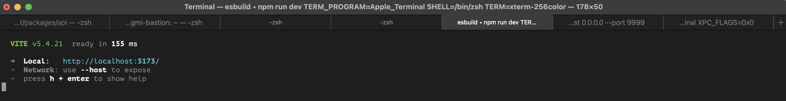
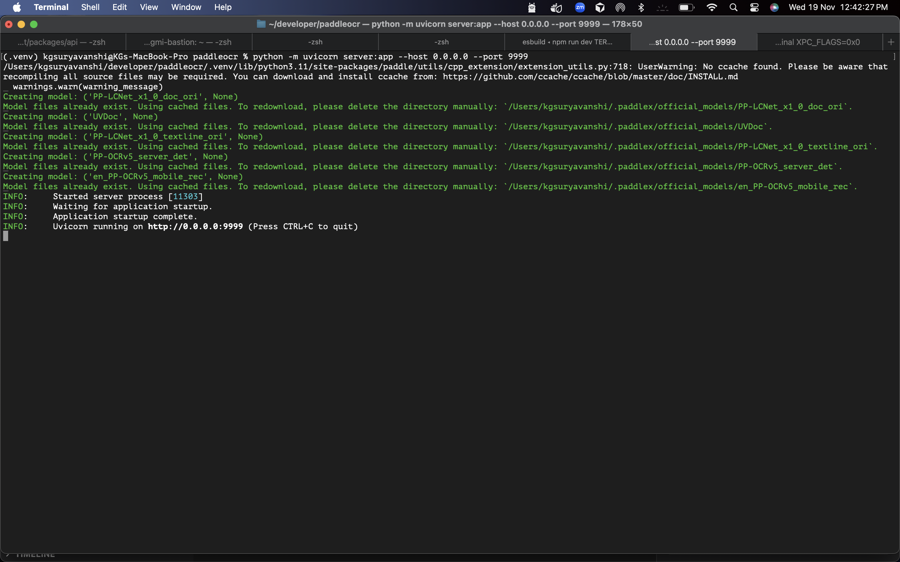

## LearningYogi – Timetable OCR Pipeline & Frontend

End‑to‑end system that:

1. Accepts timetable PDFs/images via a NestJS API
2. Uploads files to S3 and runs a multi-step OCR pipeline (DeepSeek → PaddleOCR → Google Vision → DeepSeek-R1 reasoning)
3. Normalizes data into a MongoDB `timetabledocs` collection
4. Provides a React/Vite frontend that renders the timetable in a BrainMo-style layout

---

## Repository Layout

```
learningYogi/
├─ packages/
│  ├─ api/       # NestJS backend (OCR pipeline + storage + APIs)
│  └─ app/       # React + Vite frontend (timetable viewer)
└─ README.md     # You are here
```

---

## Prerequisites

| Component | Requirement |
|-----------|-------------|
| Node.js   | v18.18+ (recommended 20.x). Current env is 18.17, which works but triggers npm warnings. |
| npm       | v9+ (ships with Node). |
| MongoDB   | Local instance or Atlas connection string. Default DB name: `learningyogi`. |
| AWS S3    | Bucket + IAM credentials for file storage. |
| PaddleOCR | Local HTTP server (Docker or Python FastAPI wrapper). |
| DeepSeek OCR | API access via OpenAI-compatible endpoint (`https://api.deepseek.com/v1`) + API key. |
| Google Vision | Cloud project + API key. |
| Ollama | Running locally with `deepseek-r1` model for reasoning step. |

Optional: Docker Desktop (to run PaddleOCR container), Postman (for testing).

---

## Backend (packages/api)

### 1. Install dependencies

```bash
cd packages/api
npm install
```

### 2. Environment variables

Create `packages/api/.env` (never commit real secrets):

```
NODE_ENV=development
PORT=3000
MONGODB_URI=mongodb://localhost:27017/learningyogi

AWS_REGION=us-east-1
AWS_S3_BUCKET=learningyogi-timetables
AWS_ACCESS_KEY_ID=your-key
AWS_SECRET_ACCESS_KEY=your-secret

OCR_CONFIDENCE_THRESHOLD=0.85

DEEPSEEK_OCR_BASE_URL=https://api.deepseek.com/v1
DEEPSEEK_OCR_MODEL=deepseek-chat       # must support image input via OpenAI responses API
DEEPSEEK_OCR_API_KEY=deepseek-key

PADDLE_OCR_URL=http://127.0.0.1:9999/ocr

GOOGLE_VISION_URL=https://vision.googleapis.com/v1/images:annotate
GOOGLE_VISION_API_KEY=google-key

LLM_REASONING_URL=http://localhost:11434/api/generate
LLM_REASONING_MODEL=deepseek-r1:7b
```

> **Important:** `DEEPSEEK_OCR_BASE_URL` must include `/v1` so the OpenAI SDK hits `https://api.deepseek.com/v1/responses`.

### 3. External services

#### PaddleOCR (local)

**Docker (recommended):**

```bash
docker run -d --name paddle-ocr -p 9999:9999 paddleserver/paddle-ocr:latest
```

Ensure the server accepts JSON `{ fileContentBase64, mimeType }` and returns `{ text, confidence }`.

**Python FastAPI wrapper (if not using Docker):**

```bash
python -m venv .venv && source .venv/bin/activate
pip install paddleocr paddlepaddle fastapi uvicorn
python server.py  # script from /Users/kgsuryavanshi/developer/paddleocr/server.py
```

Make sure uploaded buffers are written to temp files with the right suffix (`.png`, `.jpg`, `.pdf`, …) before calling `ocr.ocr`.

#### DeepSeek OCR (cloud)

1. Get API key from DeepSeek provider.
2. Confirm the selected model supports image inputs via OpenAI’s `responses.create`.
3. Update `.env` with base URL, model, and key.

#### Google Vision

1. Enable “Vision API” in Google Cloud.
2. Create an API key and set `GOOGLE_VISION_API_KEY`.
3. Billing must be enabled for production workloads.

#### Ollama (LLM reasoning)

```bash
ollama serve
ollama pull deepseek-r1:7b  # or other DeepSeek-R1 variant
```

Ensure `LLM_REASONING_URL` points to your Ollama endpoint and `LLM_REASONING_MODEL` matches the pulled model ID.

### 4. Seed sample timetable data (optional)

Creates a dummy timetable (matches BrainMo layout):

```bash
cd packages/api
npm run seed:timetable
```

Outputs inserted `timetabledocs` ID and statistics.

### 5. Run the backend

```bash
npm run start:dev
```

API base URL: `http://localhost:3000/api`

### 6. Key endpoints

| Method | Endpoint | Description |
|--------|----------|-------------|
| POST | `/api/upload?teacherId=teacher-123` | Uploads file (multipart form `file`) → stores in S3 → runs OCR pipeline → persists normalized data → returns metadata + `timetableDocId`. |
| GET | `/api/timetables` | List all timetables (optional `teacherId` query). |
| GET | `/api/timetables/:id` | Fetch single timetable document. |
| DELETE | `/api/timetables/:id` | Remove timetable document. |

### 7. Testing & linting

```bash
npm test        # Jest unit tests
npm run lint    # TypeScript type-check
```

---

## Frontend (packages/app)

### 1. Install dependencies

```bash
cd packages/app
npm install
```

> You may see npm engine warnings due to Node 18.17 vs required 18.18+. Upgrade Node (nvm install 20) for clean installs.

### 2. Environment variables

Create `packages/app/.env`:

```
VITE_API_URL=http://localhost:3000/api
```

Vite dev server also proxies `/api` to `http://localhost:3000`, so the app works without `.env` when running locally.

### 3. Run the frontend

```bash
npm run dev
```

Visit `http://localhost:5173`

### 4. Build for production

```bash
npm run build
npm run preview   # optional preview server
```

### 5. Features

- Timetable selector (filter by teacher, view metadata)
- Timetable grid replicating BrainMo UI (time slots, day columns, color-coded subjects, “Today” indicator)
- Loading/error UI states
- API client via Axios
- Modular React + TypeScript structure

---

## Running the Whole System

1. **Start dependencies**: MongoDB, PaddleOCR server, Ollama (with DeepSeek-R1), ensure DeepSeek & Google API keys ready.
2. **Backend**:
   ```bash
   cd packages/api
   npm run start:dev
   ```
3. **Seed sample data** (optional):
   ```bash
   npm run seed:timetable
   ```
4. **Frontend**:
   ```bash
   cd ../app
   npm run dev
   ```
5. Open `http://localhost:5173`, select a timetable, and the UI will fetch `/api/timetables/:id` from the backend.

---

## Troubleshooting

| Issue | Fix |
|-------|-----|
| `npm warn cli npm v11.4.1 does not support Node.js v18.17.0` | Upgrade Node via `nvm install 20 && nvm use 20`. |
| Paddle OCR requests never arrive | Ensure backend points to IPv4 (`http://127.0.0.1:9999/ocr`) and Paddle server listens on `0.0.0.0`. |
| Paddle OCR “Not supported input file type” | Make sure temp files written by server use correct extensions (e.g., `.png`, `.pdf`). |
| DeepSeek OCR 404 errors | Include `/v1` in base URL; verify model supports image input. |
| LLM reasoning fails | Confirm Ollama is running and DeepSeek-R1 model is pulled. |
| Frontend blank grid | Run seed script or upload a timetable via `/api/upload` to populate MongoDB. |

---

## Useful Commands Cheat Sheet

```bash
# Backend
cd packages/api
npm install
npm run start:dev
npm run seed:timetable
npm test
npm run lint

# Frontend
cd ../app
npm install
npm run dev
npm run build
```

---

## Future Enhancements

- Background job queue for heavy OCR
- Auth and multi-tenant teacher dashboards
- Update/delete timetables from frontend
- Analytics on OCR confidence per provider
```

## Screenshots

### 🧠 Timetable UI


### 🚀 API Server Running (NestJS)


### 🎨 Frontend (React + Vite)


### 🎨 Paddle OCR (Python)

